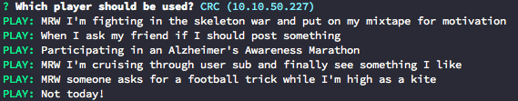

chromecast-imgur
=========

> Play the most viral imgur GIF's on your chromecast :tv:

## Install

```
git clone https://github.com/mrzmyr/chromecast-imgur.git
```

or download the [master.zip](https://github.com/mrzmyr/chromecast-imgur/archive/master.zip)

## Register

You need to [register an imgur application](https://api.imgur.com/oauth2/addclient) (really easy to do, if you have a imgur account)

## Usage

```
❯ cd chromecast-imgur

❯ node index.js <CLIENT-ID>
```

